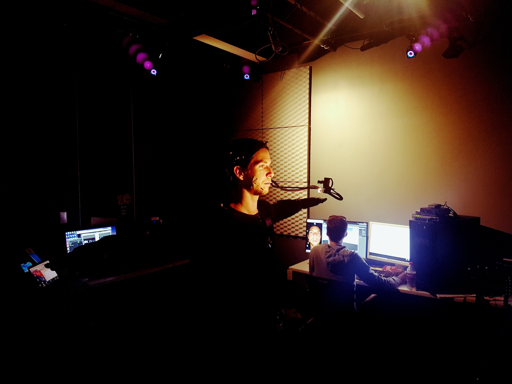
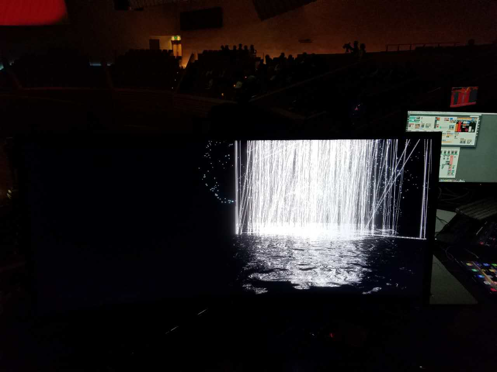

<Text sx={{ fontSize: [1, 2, 3], fontWeight: `normal`, color: `heading`}}>
Here are a few projects I've developed, as well as what I'm currently up to.
</Text>

# Current Projects
---
## 📝Citation: Hall Pass Studios
### Tiny Teaching Games
Citation is a collection of tiny-games, each designed to teach a specific topic while still being fun and challenging. You, the palyer, find yourself thrown back in time, at a point in human civilization where new fundamental knowledge (and rad pastel patterns) is flourishing: the 1980s. Unfortunately, there are some who would prefer to see knowledge acquisition stopped. These creatures operate in the shadows, and only until you’ve helped your character to better understand what it means to be an ethical scholar, can you delve further into the depths to root them out and, hopefully even recruit them to your cause.

Cool Features:
* can be played over a coffee-break on a browser
* blockchain-based high score table
* NFT accomplishments

*Download Link Coming Soon*

## The Black Sun
### A 1-bit VR platform for experimentation and metaverse preparation.
The black sun is meta-metaverse VR platform and an homage to Neal Stephenson's phenomenal sci-fi book [Snow Crash](https://www.amazon.com/Snow-Crash-Novel-Neal-Stephenson-ebook/dp/B000FBJCJE) . It's primary purpose is to allow for a new course I've designed, called Hello: Metaverse. Where students are given mobile VR headsets, and asked to create their own metaverses within the Black Sun. 

*Download Link Coming Soon*

# Past Projects
---
## HamletVR

New York, New York, Spring 2017, Tribeca Film Festival

HamletVR is an interactive virtual reality theater experience, where audience members at the Tribeca Film Festival and across the world participated in the world's first live VR theater where the motion and voice of live actors were networked in a virtual world where participants could watch and explore Shakespeare from an entirely new point of immersion.

Here is a short video describing the project:
<iframe src="https://www.youtube.com/embed/JM_aegGtAKM" title="YouTube video player" frameborder="0" allow="accelerometer; autoplay; clipboard-write; encrypted-media; gyroscope; picture-in-picture" allowfullscreen></iframe>

## Neuron

Shanghai, China, Fall 2017, International Computer Music Conference

Project Neuron was a collaboration between friends at the Shanghai Conservatory of Music. We began with the theme from the conference - hearing the self - and imagined what it would be like to visualize the entire neurological process involved in hearing sound. Furthermore, we wanted to combine the fact that everyone hears themselves differently than others do. The end result was a 5 minute live dance and motion-capture performance where each dancer was able to both impact the visuals and the music.

