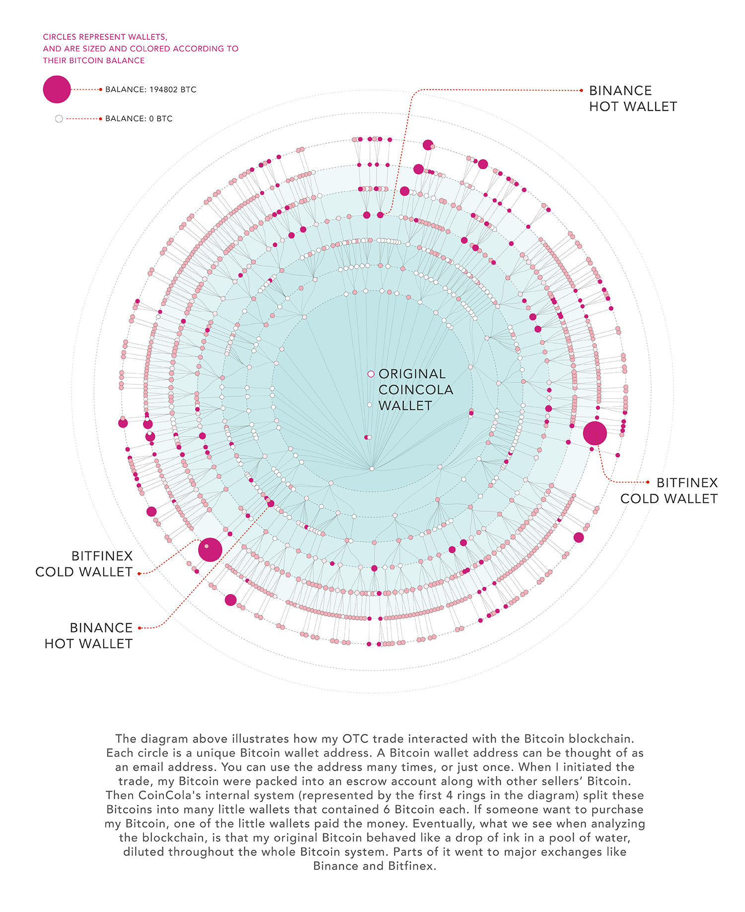

The Chinese cryptocurrency app folder on my smartphone passed away on October 31, 2017 at 11:59 pm. Prior to that, it only took a few taps to access China’s cryptocurrency exchanges. If you wanted to purchase Bitcoin with Chinese currency, or RMB, all you had to do was create an account, add your Chinese bank information, and within minutes you’d have access to the largest pool of cryptocurrency liquidity in the world.

Then, it was all over. In response to concerns about speculative mania, tax evasion, capital flight and scams, China’s central bank ordered all mainland cryptocurrency platforms to be shut down. Initial Coin Offerings (fundraising through cryptocurrency token sales) were banned. To the untrained eye, China's cryptocurrency trade was dead.

These moves caused an all-out panic across Chinese and worldwide cryptocurrency markets. I observed an almost 30% price discount between the cost of purchasing a cryptocurrency on a Chinese exchange versus on a U.S. exchange. Normally, there was a price premium for purchasing cryptocurrency in China (I’d seen anywhere between 5% and 10%) — a function of the limited speculative investment options available in the country, and the potential for cryptocurrency to evade China’s strict capital controls.

China’s cryptocurrency exchanges wasted no time in retooling their business models for a world in which Chinese regulators would ignore them provided they did not directly engage with domestic financial markets. Exchanges like Huobi and OKEx are now largely operating overseas, without a Chinese local currency deposit and withdraw function.

Meanwhile, China's crypto traders moved to over-the-counter (OTC) providers. OTC apps act as a conduit for individual buyers and sellers to exchange cryptocurrency for local currency. These web or mobile applications facilitate browsing and executing buy and sell orders. They sometimes have an automated escrow system (each party must sign off that the transaction is complete before the cryptocurrency is released) and an arbitration service if one of the traders renege on their commitment. One major OTC platform in China is the Hong Kong-based CoinCola.

### An Experiment
I decided to do a little experiment. I would try to sell some Bitcoin from Shanghai to pay for my Chinese lessons. The challenge: Could I sell Bitcoin and receive RMB in less than 10 minutes?

I opened the CoinCola app, entered my phone number, and got an SMS asking me to enter a verification code. Opening the app brought me to the trading screen, which listed a number of traders, how many trades they had done and their trading limits.

I chose Alipay as my payment method. For those of you just tuning in, China has a massive and rapidly expanding market for peer-to-peer and retail mobile payments. The payment platforms, Alipay and WeChat pay, are run by Alibaba and Tencent respectively. They are key players in a Chinese mobile payment market that reached over $15 trillion last year, according to an estimate by iResearch.

Many Chinese consumers do not carry cash, opting instead to carry their mobile device and click a button or scan a QR code to pay for nearly everything. The last time I visited an ATM machine was when traveling to Germany. I lost my bank card a year ago and haven’t bothered to get it replaced. The only reason I carry a wallet is because I still need a physical ID to gain access to my building.

Chinese mobile payment platforms can be used for everything from ride and car sharing, dock-less bikes, crowd-sourced apartment buying to micro-payments. They can also be used for peer-to-peer cryptocurrency trading.

`Time:` **Zero** 

I wanted to sell a small amount of Bitcoin (enough to pay for my Chinese lessons). So I clicked on CoinCola's “Publish an Ad of Selling." If anyone from CoinCola is reading this, by the way, I’ll translate your app into proper English for free, as a public service.

I decided to sell my BTC at a small discount (sellers often ask for a 5% premium) and in small orders in order to assure I’d be listed at the top and thus get a quick sale.  Once I posted the ad, the CoinCola app took the Bitcoin I had deposited with them, locked it in their escrow service and posted the ad. I was ready to trade. 

`Time:` **1 Minute**

Immediately after posting my ad, I was inundated with buy orders. I chose the first trader who responded, and opened the chat portion of the trading screen to close the sale. 

`Time:` **3 Minutes**

I had chosen to accept Alipay as my payment method, but because I am a foreigner, I have never been able to fully verify my identity with Alipay. Their systems are generally set up to integrate with the Chinese national identification system, which doesn’t include foreigners. Because of this my customer was told that I’m unsafe and thus it was not possible to transfer to my Alipay account.

No worries. As I mentioned, China has two competing payment platforms. The trader told me my Chinese is not bad (it is) and suggested that we switch to another platform (WeChat Pay) to complete the deal.

`Time:` **7 minutes**

I added them as contacts on WeChat, and once they confirmed I was able to instantly receive the ¥1000 RMB (about $150). Now that I had been paid, the last step in the process was for me to confirm that they paid me and release the BTC held by CoinCola in escrow. 

`Time:` **10 minutes**

Success! I was able to sell Bitcoin and receive RMB in under 10 minutes. Granted, it involved a lot more work on my part than using an exchange. I had to essentially act as my own broker, post an ad and respond to requests for trade. On top of this, Coincola takes a .7% fee on all transactions. 

Now that I had ¥1,000 RMB in my digital WeChat wallet, it was only a matter of opening a chat with my Chinese teacher and instantaneously sending her the payment, which, if she chose, could be deposited into her bank account within minutes.

### Conclusion
With the exception of internet forums or private messaging apps, centralized peer-to-peer platforms such as CoinCola or localbitcoins.com are now some of the only places to buy or sell Bitcoin with Chinese currency. These types of transactions are made possible thanks to the ubiquity, functionality, and speed provided by Chinese payment platforms like Alipay and Wechat Pay. 

What my experiment did prove is that it's still pretty easy to buy and sell cryptocurrency in China. My little experiment in China's peer-to-peer market illustrates that even after a major government crackdown, people will still find ways to exchange Bitcoin for hard currency.

